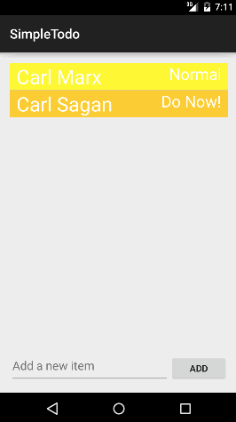

# Android Todo List

This is an Android demo application for [CodePath](https://codepath.com).

Time spent: 8-10 hours spent in total

Checklist (Tasks that are not completed are **IN PROGRESS**):

* [x] Add and remove items from the todo list
* [x] Editing items in list
* [x] Persist items over applicaiton launches
* [x] Code is pushed to github
* [x] You are reading the README (with GIF) ;)
* [x] Issue added to the repo including /cc @codepathreview @codepath in the issue body 

* [X] Persist the todo items into SQLite instead of a text file
* [X] Improve style of the todo items in the list using a custom adapter
* [ ] Add support for completion due dates for todo items (and display within listview item) - Might skip this as it seems as a repition of adding persistant priorities
* [X] Use a DialogFragment instead of new Activity for editing items
* [X] Add support for selecting the priority of each todo item (and display in listview item)
* [X] Tweak the style improving the UI / UX, play with colors, images or backgrounds 
* [X] Extra Curricular (Custom Theme - Work in progress)

GIF created with [Licecap](http://www.cockos.com/licecap/).
